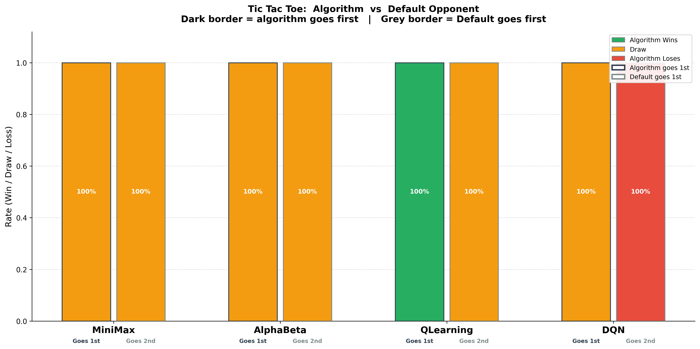
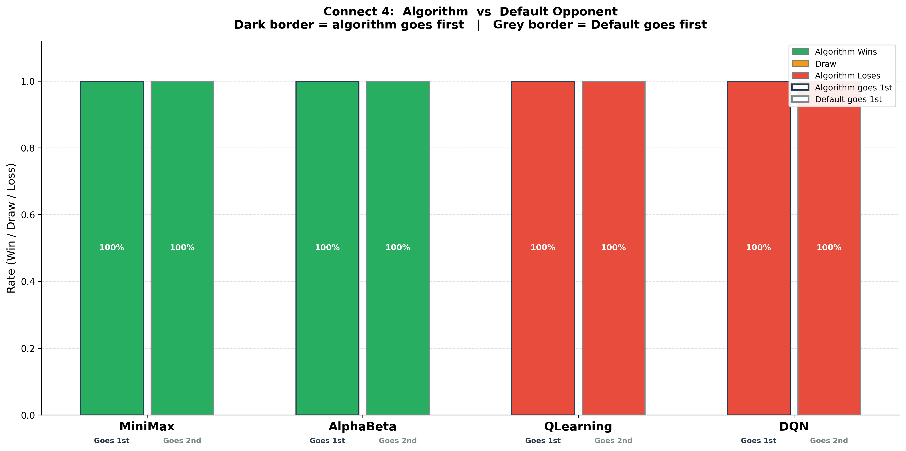
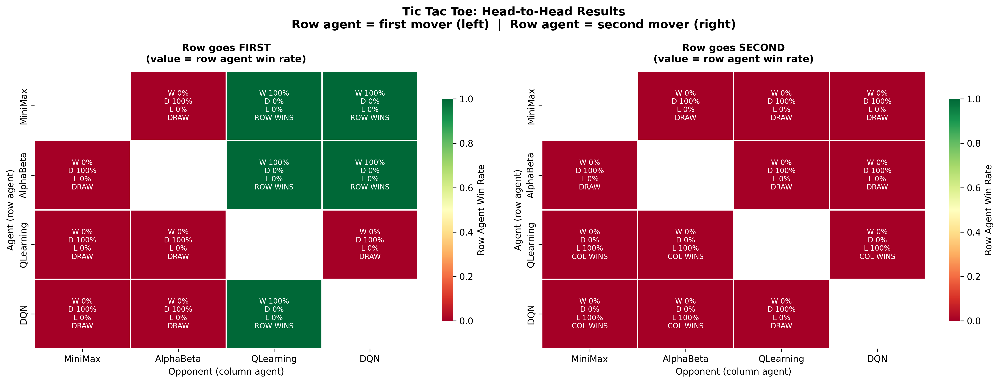
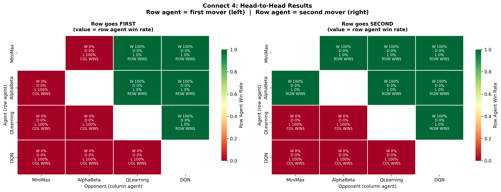
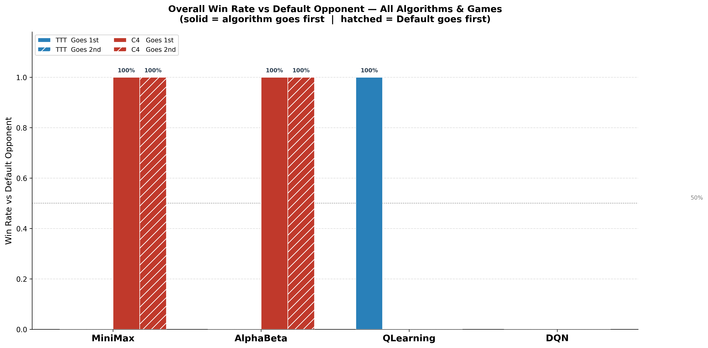

# AI Game Agents: Minimax and Reinforcement Learning
## CS7IS2 Assignment Report

**Student Name:** [Your Name]
**Student ID:** [Your ID]
**Date:** [Date]

---

## 1. Introduction

This report presents the implementation and evaluation of multiple AI game-playing agents for Tic Tac Toe (TTT) and Connect 4. The agents implemented include:
- A rule-based Default Opponent (baseline)
- Minimax algorithm (with depth-limiting for Connect 4)
- Minimax with Alpha-Beta Pruning
- Tabular Q-Learning
- Deep Q-Network (DQN)

The goal is to compare algorithm performance, analyze learning curves, and evaluate trade-offs between classical tree-search and reinforcement learning approaches.

---

## 2. Game Implementations

### 2.1 Tic Tac Toe
[Describe the board representation, move encoding, win conditions, and state space size.]

### 2.2 Connect 4
[Describe the board representation, gravity mechanic, move encoding, win conditions (4-in-a-row), and state space complexity.]

---

## 3. Agent Implementations

### 3.1 Default Opponent
[Describe the rule-based priority: win > block > strategic > random.]

### 3.2 Minimax
[Describe the algorithm, full-tree search for TTT, depth-limited search for Connect 4, and the heuristic evaluation function.]

**Heuristic weights:**
| Pattern | Weight |
|---------|--------|
| 4-in-a-row | 10,000 |
| 3-in-a-row (open) | 100 |
| 2-in-a-row (open) | 10 |
| Center column | 5 |

### 3.3 Alpha-Beta Pruning
[Describe how pruning reduces the search space and the theoretical improvement over basic Minimax.]

### 3.4 Q-Learning
[Describe the Q-table representation, epsilon-greedy exploration, update rule, and training procedure.]

**Hyperparameters:**
| Parameter | Value |
|-----------|-------|
| Learning rate (α) | 0.1 |
| Discount factor (γ) | 0.95 |
| Initial epsilon | 1.0 |
| Epsilon min | 0.01 |
| Epsilon decay | 0.9995 |

### 3.5 Deep Q-Network
[Describe the neural network architecture, experience replay, target network, and training procedure.]

**Architecture (TTT):** Input(9) → Dense(128) → ReLU → Dense(128) → ReLU → Output(9)
**Architecture (Connect 4):** Input(42) → Dense(256) → ReLU → Dense(256) → ReLU → Dense(128) → ReLU → Output(7)

---

## 4. Experimental Setup

- **Number of tournament games:** [N]
- **Training episodes:** TTT Q-Learning: 50,000 | TTT DQN: 20,000 | C4 Q-Learning: 100,000 | C4 DQN: 50,000
- **Evaluation frequency:** Every 1,000 episodes
- **Random seed:** 42

---

## 5. Results

### 5.1 Algorithms vs Default Opponent (TTT)

[Table of win/draw/loss rates]

### 5.2 Algorithms vs Default Opponent (Connect 4)

[Table of win/draw/loss rates]

### 5.3 Head-to-Head Results (TTT)

[Analysis of head-to-head matrix]

### 5.4 Head-to-Head Results (Connect 4)

[Analysis of head-to-head matrix]

### 5.5 Learning Curves

### 5.6 Nodes Explored: Minimax vs Alpha-Beta

### 5.7 Overall Comparison

---

## 6. Analysis and Discussion

### 6.1 Minimax vs Alpha-Beta
[PLACEHOLDER: Fill in measured node counts and speedup ratio.]

### 6.2 Q-Learning Convergence
[PLACEHOLDER: Fill in convergence speed, final performance, and limitations of tabular approach for Connect 4.]

### 6.3 DQN Performance
[PLACEHOLDER: Fill in DQN stability, comparison with Q-Learning, and training dynamics.]

### 6.4 Comparison Across Games
[PLACEHOLDER: Discuss why algorithms perform differently on TTT vs Connect 4.]

---

## 7. Conclusions

[Summarize key findings: which algorithm performed best, trade-offs, and limitations.]

---

## 8. References

1. Russell, S., & Norvig, P. (2020). *Artificial Intelligence: A Modern Approach* (4th ed.)
2. Sutton, R. S., & Barto, A. G. (2018). *Reinforcement Learning: An Introduction* (2nd ed.)
3. Mnih, V., et al. (2015). Human-level control through deep reinforcement learning. *Nature*, 518, 529–533.
4. [Any additional references]
